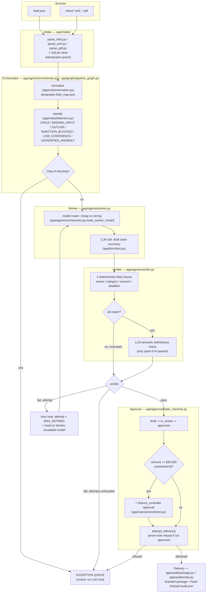

# ARCHITECTURE — Tiny CEDX Agent Fleet (CASE_ID: CEDX-EB3505)

## Topology

## Agent roster (typed contracts)

| Agent | Role | `can_call` | Input contract | Output contract |
|---|---|---|---|---|
| **orchestrator** | Owns the run — classification, routing, budget/step enforcement, retry policy. No domain judgment (delegates that to Worker/Verifier). | `worker`, `verifier` | `NormalizedRecord` | `OrchestratorDecision` |
| **worker** | Assembly — drafts the branded output from source fields only. | *(none)* | `WorkerInput { record, escalate }` | `WorkerOutput { claim_owner, claim_category, claim_amount, sla_date, summary, abstained, malformed, ... }` |
| **verifier** | Review — independently re-checks the Worker's draft; can overrule. | *(none)* | `VerifierInput { record, worker_output }` | `VerifierOutput { verdict: pass\|fail\|needs_human, checks[], reason_code }` |

Contracts are Pydantic models in [app/schemas/contracts.py](app/schemas/contracts.py) — no free-form string/dict passing between agents. `can_call` is enforced structurally: Worker and Verifier modules have zero imports of each other; only `pipeline_graph.py` (the Orchestrator's LangGraph wiring) imports and calls both.

## Where the Verifier overrules the Worker

[app/agents/verifier.py](app/agents/verifier.py) `run_verifier()`:
1. If the Worker's output is malformed (unparseable JSON) → immediate `fail`, `AGENT_MALFORMED`.
2. If the Worker abstained → `needs_human`, routed without penalty.
3. Four deterministic checks compare the Worker's echoed `claim_owner`/`claim_category`/`claim_amount`/`sla_date` against the source record's actual fields. **Any mismatch = immediate `fail`, `AGENT_HALLUCINATION`** — this is the overrule path; the Worker's draft is discarded regardless of how well-written its prose is.
4. Only if all four match does the Verifier spend one more LLM call on a semantic faithfulness check of the free-text summary.

The disagreement is logged either way: `VerifierOutput.checks` records every individual check's pass/fail, and the `agent_trace` span's `status` is `overruled`/`rejected` when the Verifier disagrees with the Worker.

## Where budget/router decisions live

[app/agents/orchestrator.py](app/agents/orchestrator.py):
- `route_worker_model()` — cheap model by default; escalates to the strong model on any retry, or proactively when a claim's amount is ≥50% of the amendment threshold.
- `would_exceed_budget()` / `would_exceed_steps()` — called by `pipeline_graph.py`'s `node_worker` **before** any LLM call is made, using a pre-call cost estimate. A record that would exceed either ceiling raises `BUDGET_EXCEEDED`/`AGENT_LOOP` and is routed to the exception queue with zero spend — never a post-hoc overspend.

## Approval chain + amendment

[app/approval/state_machine.py](app/approval/state_machine.py) — explicit state machine: `draft -> in_review -> (changes_requested -> in_review)* -> approved -> delivered`, with `blocked` as the refusal state. `attempt_delivery()` is the single method that ever appends a `delivered` event, and it independently re-checks approval status itself (doesn't trust the caller) — raises `DeliveryRefused` if there's no `approved` event, or if the CASE_ID amendment applies (`amount >= $35,000`) and there's no `finance_controller`-prefixed approval on the trail.

## Audit / observability

[app/audit/writer.py](app/audit/writer.py) — every event carries `prev_hash` + `event_hash` (a hash chain), so `out/audit.json`'s `events` array is tamper-evident, not just "append-only by convention." Every processed record carries a non-empty `agent_trace` (even blocked ones get an `orchestrator` span explaining why), and every delivered record's `transcript_hash` points at a committed, content-addressed transcript in `transcripts/` whose `response_hash` is independently re-derivable.
